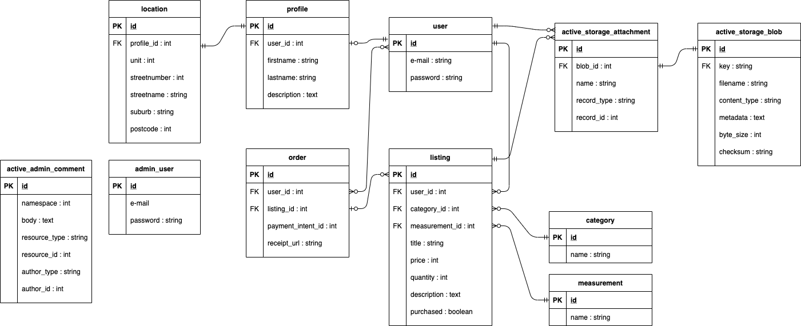

# T2A2 - Marketplace Project
## Problem
Thesedays people stays at home longer than before because of COVID-19 pandemic. People enjoys coooking at home and have a home kitchen garden. However, there is no platform they can share their home grown vegetables, furits and other food.

## Why is it a problem that needs solving?
- Major Problems for food waste acordding to [Australian government](https://www.environment.gov.au/protection/waste/food-waste#:~:text=Food%20waste%20is%20also%20a%20major%20problem%20in,five%20per%20cent%20of%20Australia%E2%80%99s%20greenhouse%20gas%20emissions.)
1. Each year there is about 7.3 million tonnes of food waste - this is eaquls to 300 kg per person
2. Food waste costs the economy about $20 billions each year
3. Food waste accounts for more than five per cent of Australia’s greenhouse gas emissions
 
Globally, the amount of food waste is about 1.3 billion tons and One third of the world's food is wasted. This serious problem is not only for restaurants and shops but also at home.  
People sometimes throw food away even if the food is not expired or uneatble. There is no platform they can share their homemade food or homegrown vegetables and fruits.   
The goal of this project is to reduce food waste at home. It will also helps people making a connection in a local community.

## Links
- Heroku
- Github

## Description of this application
### Purpose 
The purpose of this app is to provide a platform where people can share their homemade food and homegrown vegetables and fruits. It allows to buy cheap and fresh vegetables from local area and make local connections.

### Function / Features
#### User 
- Sign up to use this app
- Only user who has profile can share or buy items
- View a seller's profile, picture and item list
- User can have more than one items 

#### Listing
- A search form that user can search items by item title, category or/and suburb in listing page
- A top page displays new item list
- User can see a item brief overview in a listing page and then click "See more" to see more details and buy the item. The details include title, price, place and description.

#### Payment
- This application uses Stripe as a third party
- User can check the receipt after purchase

### Sitemap

### Screenhosts

### Target audience
- People who has a kitchen garden
- People who likes cooking
- People who started a small food bussiness
- People who want to buy fresh vegetables and fruits from local area
- People who want to build a connection in their local community especially if they now work from home due to COIVD-19.

### Tech stack
- HTML
- CSS
- Bootstrap
- AWS S3 (Image upload)
- Stripe (Payment system)
- Devise (User authentication)
- Heroku (Deployment)
- PostgresQL (Relational database)
- Github
- Javascript (UI/UX design)
- Balsamiq
- Drawio
- Trello
- Unsplash (Free pictures)

## User stories

## Wireframe

## ERD

## Explain the different high-level components (abstractions) in your app

## Detail any third party services that your app will use
## Describe your projects models in terms of the relationships (active record associations) they have with each other
## Discuss the database relations to be implemented in your application
## Provide your database schema design
## Describe the way tasks are allocated and tracked in your project

R7	Identification of the problem you are trying to solve by building this particular marketplace app.
R8	Why is it a problem that needs solving?
R9	A link (URL) to your deployed app (i.e. website)
R10	A link to your GitHub repository (repo).
R11	Description of your marketplace app (website), including:
- Purpose
- Functionality / features
- Sitemap
- Screenshots
- Target audience
- Tech stack (e.g. html, css, deployment platform, etc)
R12	User stories for your app
R13	Wireframes for your app
R14	An ERD for your app
R15	Explain the different high-level components (abstractions) in your app
R16	Detail any third party services that your app will use
R17	Describe your projects models in terms of the relationships (active record associations) they have with each other
R18	Discuss the database relations to be implemented in your application
R19	Provide your database schema design
R20	Describe the way tasks are allocated and tracked in your project
