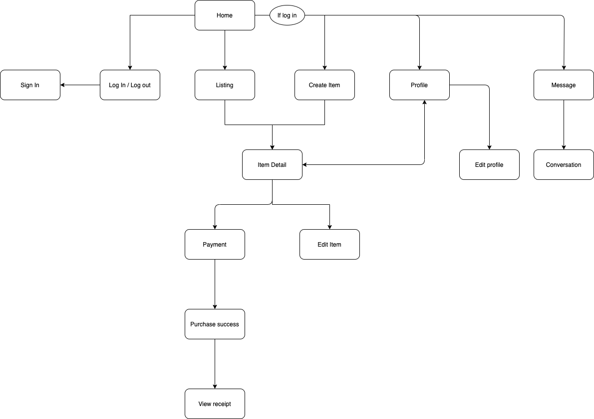

# T2A2 - Marketplace Project
## Problem
Thesedays people stays at home longer than before because of COVID-19 pandemic. People enjoys coooking at home and have a home kitchen garden. There are many platforms for cloth, furnitures and more. However, there is not such a specify platform they can share/sell their home grown vegetables, furits and other food. Also, for some marketplaces the user doesn't have to have a proper profile, so there are many untrustworthy accounts, so people who wants to sell their vegetables or fruits, they have to go to market or sell to restaurants or delis.  Those actions are not easy for most of people especially for someone who enjoys gardening and cooking as thier hobbies. As a result, they might have to throw food away and it causes food waste. 

## Why is it a problem that needs solving?
There are Problems for food waste according to [Australian government](https://www.environment.gov.au/protection/waste/food-waste#:~:text=Food%20waste%20is%20also%20a%20major%20problem%20in,five%20per%20cent%20of%20Australia%E2%80%99s%20greenhouse%20gas%20emissions.)
1. Each year there is about 7.3 million tonnes of food waste - this is eqauls to 300 kg per person
2. Food waste costs the economy about $20 billions each year
3. Food waste accounts for more than five per cent of Australia’s greenhouse gas emissions
<br>
As I discussed there is no platform for seller to sell home grown vegetables, so people sometimes throw food away even if the food is not expired or uneatble. 
The food waste is one of the global problem and we need to work on it as a personal and as a community. In this application, they can sell their vegetables or fruits in thier community and they can also make a connection with someone who has a same interests. 
The goal of this project is to reduce food waste at home and provodes an opprtunity to sell/buy home grown vegetables and other homemade food.  It will also help accelerate local trade market and revitalises local economy. 

## Links
- [Heroku](https://share-your-garden.herokuapp.com/)
- [Github](https://github.com/yrikw/marketplace_app)

## Before you start
1.Open terminal on your PC. There are two ways to open. <br>
- Application -> Utilities -> Terminal.app
- command + space -> Open spotlight -> Search terminal.app
2. Run git clone to install this application
``` git clone https://github.com/yrikw/marketplace_app.git```
3. If you don't have homebrew or bundler, go to step 4. If you have them go to step 8 
4. Install homebrew
```/bin/bash -c "$(curl -fsSL https://raw.githubusercontent.com/Homebrew/install/master/install.sh)"```
* If the terminal asks you password, type password for your Mac login.
5. Update to make sure if it is installed properly. 
``` brew update ```
6. Install bundler
``` gem install bundler ```
7. Run 'bundle install' to install dependencies
``` bundle install ```
8. Create database and migrate
```rails db:create ```
```rails db:migrate ```
10. Run 'rails s' to see the server 
``` rails s ```
9. In your browser, access to below URL to view this application
``` http://localhost:3000/  ```


## Description of this application
### Purpose 
The purpose of this app is to provide a platform where people can share their homemade food and homegrown vegetables and fruits. It allows to buy cheap and fresh vegetables from local area and make local connections.

### Function / Features
#### User 
- Sign up to use all functions<br>
Users can see items withour sign-up but they need to sign-up. 
- Only user who has profile detail can share items<br>
To share items, user needs to fill profile details. 
- Buyer can view a seller's profile, picture and item list<br>
Buyer can see the seller's detail so they can know what kind of person seller is and if they can trust the items/seller. Buyer can buy items without worry. 
- User can have more than one items<br>
User can share items as many as they want and also choose quantity, so they can sell from small amount.

#### Listing
- A search form that user can search items by item title, category or/and suburb in listing page<br>
Buyer can search items in search form, then they can find what they want efficiently and it makes them exploring the application.
- A top page displays new item list<br>
User can check all new items on the top page. If they check the application constantly, they just can see top page.
- User can see a item brief overview in a listing page and then click "See more" to see more details and buy the item. The details include title, price, place and description.<br>
In the listing page, there is title, price and location, then if user is interested in the item, they can click "See more" to read a detail of the item. Also, even if they use smartphone, the design is two colums so they don't have to scroll one by one. 

#### Payment
- This application uses Stripe as a third party<br>
Using Stripe makes the purchasing process smoothly and they can use credit card and it is also tracked. 
- Buyer can check the receipt after purchase<br>
Buyer can check a details of the purchase and also seller's detail to make sure if it is correct.

### Sitemap


### Screenhosts

### Target audience
- People who has a kitchen garden
- People who likes cooking
- People who want to buy fresh vegetables and fruits from local area
- People who want to build a connection in their local community especially if they work from home due to COIVD-19

### Tech stack
- HTML
- CSS
- Bootstrap
- AWS S3 (Image upload)
- Stripe (Payment system)
- Devise (User authentication)
- Heroku (Deployment)
- PostgresQL (Relational database)
- Github
- Javascript (UI/UX design)
- Balsamiq
- Drawio
- Trello
- Unsplash (Free pictures)

## User stories


## Wireframe


## Explain the different high-level components (abstractions) in your app
This application is created with Ruby one Rails.　Models, views, and controllers are called MVC architectures。 Models (the part that deals with data), views (the part that produces user-visible results), and controllers (which process user requests and work with models and views). How MVC works in this applicatio is requests from users will be received as URLs. The "routes.rb" file is used to analyze the URL received and determine which controller should perform the action. This file enumerates which action to call on which controller when it is any URL. A model is provided for each table in a database. Actions in user requests interact with the database through the model to retrieve data or store new data. The data retrieved through the model and change it into a variable. The view creates an HTML document using the data passed through the variable. 

## Detail any third party services that your app will use
- Device<br>
Device is installed to handle user authentication and user account creation. User can sign-up with their e-mail and password, then they can create a profile detail. In the application, "current_user" is used to share items, purchase items and create a profile. This allows to show the functions only sign-up user can use.

- Amazon S3<br>
Amazon S3 is one of the object storage service that provides data availability, security and performance. In this application, this is used for image upload. It allows user to upload many images and stored them with a strong security. 

- Stripe<br>
Stripe allows to handle payment system. User can purchase items and pay thorugh this service with a credit card. Also, they can check receipt after purchase. The payment is also stored as data in the payment table so if there is something problem, the administer can track it. 


## Describe your projects models in terms of the relationships (active record associations) they have with each other
In this project, there are listing model, category model, measurement model, user model, order model, profile model and location mode. In those models, there is defined how to make relations between different databases and also the data should be stored. For example, user can have many listing items. Listing item is included category and measurements. When the user wants to delete the item, the data in category and measurement should be deleted too. However if the models don't have relationships each other, we have to write a code for each database so to define the relationship makes  code simpler and easier. For user, user can have one profile and location belongs to the profile. If we use "accepts_nested_attributes_for", it allows to save profile data and location data in the same view. 

- User
``` 
class User < ApplicationRecord
  has_one :profile
  has_many :listings
end
```
- Profile
``` 
class Profile < ApplicationRecord
  belongs_to :user
  has_one_attached :picture
  has_one :location
  accepts_nested_attributes_for :location
end
```
- Location
``` 
class Location < ApplicationRecord
  belongs_to :profile
end
```
- Listing

``` 
class Listing < ApplicationRecord
  belongs_to :category
  belongs_to :measurement
  belongs_to :user
  has_one_attached :picture
  has_one :order, dependent: :destroy
end
 ```
 - Category
``` 
class Category < ApplicationRecord
    has_many :listings
end
```
- Measurement
 ```
class Measurement < ApplicationRecord
    has_many :listings
end
```
- Order
```
class Order < ApplicationRecord
  belongs_to :user
  belongs_to :listing
end
```


## Discuss the database relations to be implemented in your application
## ERD


### Listing 
Listing has relations with category, measurement, order and user.
To make an item list, user needs to choose one category and one measurement, so listing can not be created without them. "has_many" is used for category and measurement because they can have many items for each colums. If a user deletes a listing item, the related data has to be also deleted from category and measurement tables. 

### User
User can have only one profile in this applicationn and they can create many listing items. The profile has to have a user and locaton has to have a profile. "has_one" is used for profile and location, so user can have only one profile and one location. 

### Order
Order "belongs to" user and listing, so the data which is stored in order table can relate user_id and listing_id, so administrator (or someone who has right to access) can see who purchased which items. 


## Provide your database schema design
## Describe the way tasks are allocated and tracked in your project


R12	User stories for your app
R13	Wireframes for your app
R14	An ERD for your app
R15	Explain the different high-level components (abstractions) in your app
R16	Detail any third party services that your app will use
R17	Describe your projects models in terms of the relationships (active record associations) they have with each other
R18	Discuss the database relations to be implemented in your application
R19	Provide your database schema design
R20	Describe the way tasks are allocated and tracked in your project
